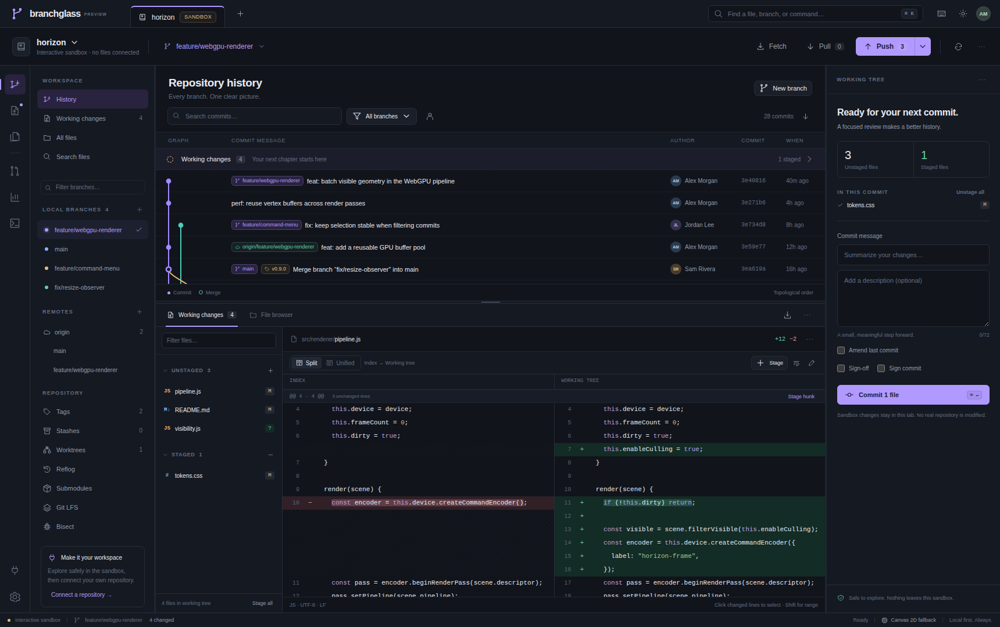

# Branchglass
### Your code, in perspective.

**[Open Branchglass in your browser](https://wieslawsoltes.github.io/Branchglass/)** · [Publishing guide](docs/PUBLISHING.md)

The hosted app starts in sandbox mode and also offers the experimental browser-folder/browser-storage adapter. Full native Git workflows use the local launcher below.

A local-first Git workspace with a plain HTML/CSS/JavaScript interface, a real WebGPU commit-graph renderer, virtualized history and diffs, and an optional, dependency-free Node.js bridge to your installed Git.

**Version 0.1.0 — functional engineering preview.** The native route performs real repository operations and has automated integration coverage. The browser-only Git adapter is experimental. This is not a claim of feature parity with every Git client, a security-audited release, or a hardware performance benchmark.



## Start with the real native Git backend

Install Node.js 20 or newer and Git, extract this project, and run these commands from its directory. There is **no `npm install`, build step, or framework runtime required** for this route.

```sh
# A real, isolated sample repository, created under your home directory:
npm run demo
```

Open the **private URL printed in the terminal**, including its `#token=...` fragment. The sample has actual commits, branches, a merge, tags, and working changes. Unlike the standalone preview's sandbox, operations here alter a real sample repository. The launcher reuses that sample on subsequent starts; it does not reset your changes.

To work on your own repository:

```sh
node server/index.mjs --root "/absolute/path/to/projects" \
  --repo "/absolute/path/to/projects/my-repository"
```

`--root` authorizes a directory and its descendants. Use the narrowest practical root. The working tree, Git directory, and common Git directory must all be inside it. Worktrees therefore need a root containing both the worktree and their common repository. Default root: your home directory. Default port: 4173.

On Windows, pass your own absolute paths, for example:

```powershell
node server/index.mjs --root "C:\Users\you\source" --repo "C:\Users\you\source\project"
```

The implementation uses platform path APIs, but this delivery was tested on Linux, not independently on Windows or macOS. Interactive rebase's editor-command quoting in particular still needs cross-platform validation.

```sh
node server/index.mjs --help
node server/index.mjs --root "/your/projects" --port 4174
```

Keep the launch URL secret. The bridge binds only to `127.0.0.1`. Do not expose it through a reverse proxy, a tunnel, or a public network interface. Stop it with Ctrl+C.

## Three deliberately distinct modes

| Mode | What it is | Persistence and requirements |
| --- | --- | --- |
| Interactive sandbox | The built-in Horizon example, with in-memory editing, staging, and commits | Clearly labeled **SANDBOX**. Does not touch local files or simulate successful network calls. Reloading resets it. |
| Native Git bridge | Browser UI controlling the installed Git through a loopback API | Real local folders and HTTPS/SSH remotes. Node.js + Git. Best-covered and broadest route. |
| Browser Git | Opt-in isomorphic-git adapter over a granted directory or browser-private storage | Experimental, narrower operations. Supporting browser, permission, optional library, and remote CORS requirements. |

`Branchglass.html` is a self-contained **UI/sandbox preview**. Open it to explore the interface without starting Node. For real native repositories, use the private URL from the launcher, not a hosted copy of the preview. Browsers or embedded file viewers can restrict `file:` scripts and APIs; the launcher avoids many such restrictions.

## Implemented workspaces and workflows

**History and navigation.** Topological commit graph using actual parent relationships; local/remote/tag reference badges; commit metadata; first-parent commit file comparisons including renames; branch, author, message, and file filters; load-more; file history; read-only historical file browsing; two-revision comparisons; repository tabs and recent repositories; command palette; context menus; keyboard shortcuts; resizable panels; light and dark themes.

**Changes and editing.** Split and unified text diffs; grouped context; syntax coloring; intraline highlights; selectable changed lines and ranges; native whole-file, hunk, and line staging/unstaging; file creation, editing, renaming and deletion; a text editor with line numbers, find, Tab indentation, and keyboard save; stale-save rejection using content hashes; unsaved-navigation confirmation; staged/unstaged separation; commit messages with descriptions, amend, sign-off, and native signing configuration.

**Visual inspection.** Side-by-side and wipe image comparisons; a bounded hexadecimal preview for binary files; content downloads; blame; reflog; tracked-file literal search; loaded-history activity and contributor summaries. The summaries explicitly describe the loaded/filter-selected commits, not an entire repository unless that history is loaded.

**Native repository operations.** Open/init/clone, create/rename/delete branches, checkout including detached revisions, annotated/lightweight tags, merge, rebase, interactive rebase, cherry-pick, revert, reset, fetch, pull, push, force-with-lease, remote configuration, stashes, worktree add/remove/lock/unlock, patch export/import, submodule status/add/update, and manual bisect controls. Destructive operations ask for confirmation; Git's own errors are surfaced.

**Conflict resolution and history editing.** Base/ours/theirs views, editable result, whole-version or individual-block acceptance, marker detection, save-and-stage, and continue/abort/skip controls. Interactive rebase supports pick, reword, squash, fixup, drop, and ordering. It rejects plans containing merge commits rather than silently flattening them.

**GitHub collaboration.** An opt-in direct REST client for pull requests, issues, and workflow runs, including PR creation, review submission, SHA-checked merging, issue creation, workflow rerun/cancel, and pagination. The tab asks for an owner/repository and token. The token is held in memory, not saved by Branchglass. These endpoints have mocked contract tests; live authenticated GitHub workflows were not tested in this environment. The provider feature is not required to use Git remotes. GitLab, Bitbucket, and other Git hosts can still be used through native Git; their review/issue APIs are not implemented.

**Git LFS controls** cover status, tracked-file listing, pull, and track patterns when Git LFS is separately installed. LFS upload commonly depends on a pre-push hook. Hooks are disabled by default here. Use a trusted native LFS workflow or deliberately enable hooks; do not assume pushing a pointer also uploaded its LFS object.

## Browser-only repositories

The frontend itself has no framework dependencies. Actual browser Git operations use the optional **isomorphic-git 1.41.9** distribution, loaded on demand. It is **not included** in this archive. The native route and sandbox never require it.

From a machine with network access:

```sh
npm run vendor
```

This downloads the pinned distribution and its license into `web/vendor/`. Review the downloaded dependency before using it with sensitive data. Without a vendored copy, choosing browser mode attempts the pinned jsDelivr distribution. There is no silently selected public CORS proxy.

Serve the `web/` directory on a trusted localhost or HTTPS origin, or use the launcher and explicitly choose the browser backend. Use **Open repository → Browser folder** to grant an existing folder, or **Clone / Initialize → Browser storage** for an origin-private repository. In a browser-only deployment, only the static files are needed; do not publish `server/`, local repositories, or credentials.

The adapter implements history, diffs, the file tree/editor, whole-file staging, commits, local branches/tags, and HTTPS clone/fetch/push. Name/email, an optional trusted CORS proxy, and memory-only remote credentials are available in Settings. Native mode is required for partial staging, advanced history editing, pull/merge/rebase, signing, stashes, worktrees, and the broader tools.

Directory picking requires user activation, permission, and a supporting secure-context browser. Remote Git HTTP often needs CORS cooperation or a proxy you control; that proxy can observe credentials and repository traffic. SSH and native credential helpers belong to the native route. These are platform constraints, not features a static page can remove. See the primary documentation in [Architecture](docs/ARCHITECTURE.md).

For safety, browser writes reject detected executable modes, symlinks, submodules, attributes, normalization, sparse checkout, advanced extensions, and in-progress sequence operations. Clone downloads objects **before** the compatibility check and checkout; a rejected clone may leave a partially initialized browser-storage folder. Not every unusual Git configuration is detected. This adapter is not a replacement for a POSIX filesystem or native Git. Do not use it concurrently with another Git client, and use a disposable copy first.

Browser-private storage is tied to the origin/profile and may be cleared. Push or otherwise back up important work. The app does not currently export a complete repository archive.

## Rendering architecture

The graph renderer uses actual WGSL shaders, an interleaved vertex/color buffer, triangle-list draw calls, device-pixel-ratio scaling, reusable growing GPU buffers, and on-demand invalidation. Graph geometry is culled to the visible area; the loaded edge/node lists are still scanned during geometry generation. Canvas 2D is the explicit fallback when WebGPU or an adapter is unavailable.

History, diff and blame text remain selectable virtualized DOM rather than GPU-rasterized text. Diff/layout calculations use a module worker where permitted and a synchronous fallback otherwise. The editor is a native textarea, not a second IDE engine. This hybrid is intentional: GPU geometry without sacrificing text selection, familiar inputs, or basic accessibility.

Open **Command palette → Rendering diagnostics** to see the selected renderer, mounted row counts, geometry vertex count and CPU submission duration. That duration is **not a GPU execution time or FPS measurement**. Hardware WebGPU execution was not available for end-to-end validation in this delivery environment.

## Keyboard essentials

| Shortcut | Action |
| --- | --- |
| Ctrl/⌘ K | Command palette |
| Ctrl/⌘ P | Find a file |
| Ctrl/⌘ O | Open repository |
| Ctrl/⌘ S | Save editor |
| Ctrl/⌘ Enter | Commit the staged draft |
| Ctrl/⌘ Shift R | Refresh repository |
| Alt 1 / 2 / 3 | History / Changes / Files |
| J / K, or arrow keys | Move through commits when history is focused |
| Shift-click a changed line | Select a range for partial staging |
| Ctrl/⌘ F | Find in editor |

## Verification

```sh
npm test
npm run build:preview
```

The shipped result is **26 passing Node tests** plus **17 passing browser UI checks**. Native tests use disposable repositories and local bare remotes. They exercise real index mutations, commits, renames, merge recovery, rebase transformations, worktrees, patch application, clone/fetch/push/pull, reset/cherry-pick/revert/bisect, and security boundaries. Diff testing includes 1,500 deterministic randomized pairs.

The UI checks exercised the actual application and `NativeProvider` against the real loopback API. The restricted test browser required an inline-content harness, test-provided SHA-256/storage, and HTTP forwarding; it used the Canvas fallback. A synthetic 5,000-commit scene mounted **14 history rows** at the captured viewport. That verifies virtualization, not universal throughput.

The optional Python/Playwright UI harness is `tests/ui_smoke.py`; see [Test report](docs/TEST_REPORT.md) for reproduction, exact scope and untested areas. No live hosting-account changes or user repositories were used.

## Important boundaries

Text editing and per-side diffs are limited to 4 MiB, Git output to 32 MiB, loaded history to 5,000 commits (500 initially), and interactive rebase plans to 200 commits. Very divergent text can fall back to a correct but nonminimal diff after a work budget. File-tree and secondary data-list DOM are not fully virtualized. Extremely long lines, large monorepos, accessibility with particular assistive technologies, and mobile workflows need further validation.

Partial staging of *working* content is disabled when Git attributes or `core.autocrlf` can transform it. Whole-file staging delegates those transformations to native Git. Binary/non-UTF-8 editing, symlink editing, merge-preserving interactive rebase, sparse-checkout UI, subtrees, Git-flow wizards, virtual/uncommitted branch lanes, general terminal execution, IDE language servers, native OS shell integration, OAuth credential-vault integration and all-host review parity are not implemented.

Read [Security](docs/SECURITY.md) before using important repositories. Hooks are disabled by default, but native filters, credentials, SSH/signing helpers and Git configuration can still execute programs. This is not a repository sandbox. Keep independent backups; an engineering preview can still have bugs.

## Project map

```text
web/                   Plain HTML/CSS/JS application
  app.js               State, views, actions and event orchestration
  core/diff.js         Bounded diff, patches, conflict parsing and graph layout
  core/gpu.js          WGSL graph renderer and Canvas fallback
  core/worker.js       Worker protocol
  core/providers.js    Native, browser and sandbox providers
  core/fs-access.js    Granted-directory filesystem adapter
  core/github.js       Opt-in GitHub REST client
  core/ui.js           Accessible HTML helpers, dialogs, palette utilities
server/                Node built-ins, authenticated loopback server and Git API
scripts/               Optional vendoring and self-contained preview builder
tests/                 Native, diff, provider, renderer and UI checks
docs/                  Feature research, architecture, security and test evidence
Branchglass.html       Generated self-contained sandbox preview
```

The [feature research](docs/FEATURE_RESEARCH.md) covers eleven representative clients and maps their common workflows to this implementation. It is a source-based comparison, not a claim that every client or every proprietary feature was exhaustively reproduced.

MIT license for Branchglass code. See [third-party notices](THIRD_PARTY.md) for the optional browser Git dependency. No font files, proprietary screenshots, or competitor code are bundled.
